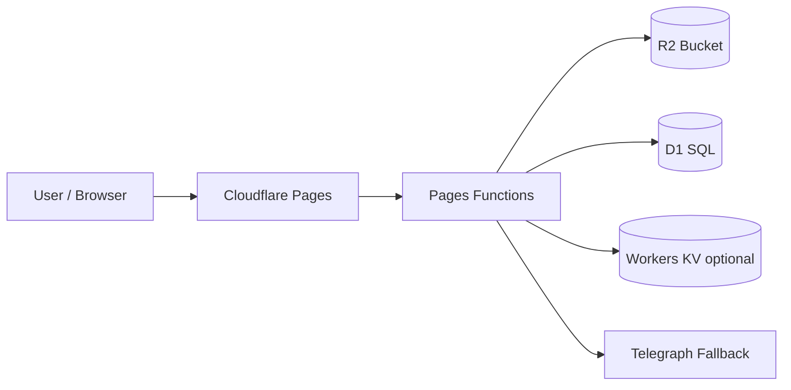

# Telegraph-Image

<p align="center">
  
</p>

<p align="center">
  
  
  
  
</p>

<p align="center">
  A Cloudflare-native file hosting project.<br/>
  Supports <b>any file format upload</b>, admin management, block/whitelist policies, and legacy Telegraph fallback.
</p>

<p align="center">
  <a href="https://dash.cloudflare.com/?to=/:account/pages/new">
    
  </a>
</p>

---

## Contents

1. [Highlights](#highlights)
2. [Architecture](#architecture)
3. [Quick Deploy](#quick-deploy)
4. [Bindings and Env](#bindings-and-env)
5. [API](#api)

---

## Highlights

- Upload any file type
- R2 for file body storage
- D1 for metadata/index/moderation states
- Optional KV for compatibility/cache
- Admin dashboard with list/block/whitelist/delete
- Telegraph fallback for legacy `/file/*` links

---

## Architecture



Recommended storage split:

- File objects: `R2`
- Structured metadata: `D1`
- Lightweight cache/compatibility: `KV`

---

## Quick Deploy

1. Create a Cloudflare Pages project and connect this repo.
2. Create an R2 bucket, for example `telegraph-image-files`.
3. Create a D1 database, for example `telegraph_image`.
4. Optionally create a KV namespace and bind it as `img_url`.
5. Fill your real IDs in `wrangler.toml`.
6. Apply D1 migration:

```bash
wrangler d1 migrations apply telegraph_image
```

---

## Bindings and Env

### Required Bindings

- `FILE_BUCKET` => R2 bucket
- `DB` => D1 database

### Optional Binding

- `img_url` => KV namespace

### Optional Environment Variables

- `BASIC_USER` / `BASIC_PASS`
- `WhiteList_Mode=true`
- `ModerateContentApiKey`

---

## API

- `POST /upload`
  - Input: `multipart/form-data`, field `file` (also supports `Files`)
  - Output: `[{ "src": "/file/<id>" }]` (frontend-compatible)
- `GET /file/:id`
- `GET /api/manage/list`
- `GET /api/manage/block/:id`
- `GET /api/manage/white/:id`
- `GET /api/manage/delete/:id`

---

Chinese + embedded English: see [README.md](./README.md)
