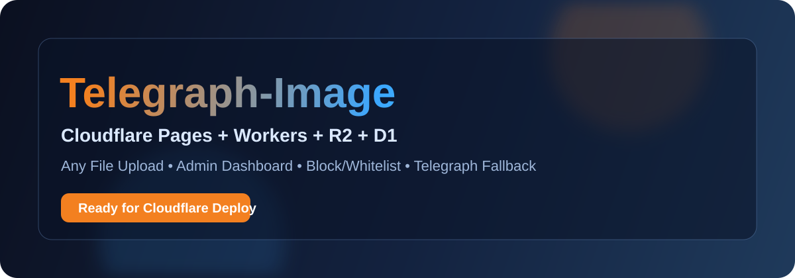
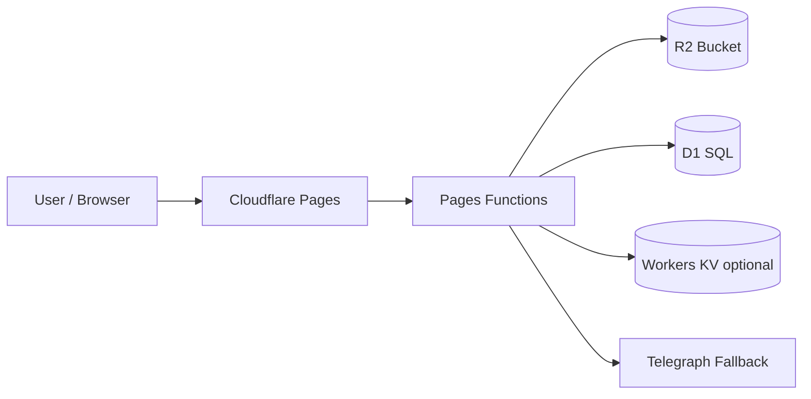

# Telegraph-Image

<p align="center">
  
</p>

<p align="center">
  
  
  
  
</p>

<p align="center">
  一个基于 Cloudflare 的高性能文件床项目。<br/>
  支持 <b>任意文件格式上传</b>、后台管理、黑白名单策略、历史 Telegraph 链接兼容访问。
</p>

<p align="center">
  <a href="https://dash.cloudflare.com/?to=/:account/pages/new">
    
  </a>
</p>

---

## 目录

1. [项目亮点](#项目亮点)
2. [技术架构](#技术架构)
3. [快速部署](#快速部署)
4. [环境变量与绑定](#环境变量与绑定)
5. [API 说明](#api-说明)
6. [English Version (Embedded)](#english-version-embedded)

---

## 项目亮点

- 任意文件上传：不限图片/视频，统一走 `R2` 存储
- 元数据管理：`D1` 维护索引、状态、时间戳
- 管理后台：支持查看、拉黑、白名单、删除
- 安全策略：黑白名单 + 可选基础认证
- 兼容模式：旧 `/file/*` Telegraph 资源可继续访问（回退）
- Cloudflare 原生：Pages Functions + R2 + D1 + KV（可选）

---

## 技术架构



数据分层建议：

- 文件本体：`R2`
- 结构化元数据：`D1`
- 轻量缓存/兼容：`KV`

---

## 快速部署

1. Fork 或上传本仓库到 Git 提供商
2. 在 Cloudflare 创建 Pages 项目并连接仓库
3. 创建 R2 Bucket（例如：`telegraph-image-files`）
4. 创建 D1 数据库（例如：`telegraph_image`）
5. （可选）创建 KV 命名空间（`img_url`）
6. 修改 `wrangler.toml` 中的真实 `database_id` 和 KV `id`
7. 执行 D1 初始化迁移：

```bash
wrangler d1 migrations apply telegraph_image
```

---

## 环境变量与绑定

### 必需绑定

- `FILE_BUCKET` -> R2 Bucket
- `DB` -> D1 Database

### 可选绑定

- `img_url` -> KV Namespace（缓存/兼容）

### 可选环境变量

- `BASIC_USER` / `BASIC_PASS`：后台 Basic Auth
- `WhiteList_Mode=true`：开启白名单模式
- `ModerateContentApiKey`：内容审核服务 Key（如需）

---

## API 说明

- `POST /upload`
  - 入参：`multipart/form-data`，字段 `file`（兼容 `Files`）
  - 返回：`[{ "src": "/file/<id>" }]`（兼容旧前端）
- `GET /file/:id`
  - 优先从 R2 读取，按策略判断是否拦截
  - 对历史数据自动回退 Telegraph
- `GET /api/manage/list`
- `GET /api/manage/block/:id`
- `GET /api/manage/white/:id`
- `GET /api/manage/delete/:id`

---

## English Version (Embedded)

<details>
<summary><b>Click to expand full English README</b></summary>

## Telegraph-Image

A Cloudflare-native file hosting project powered by Pages Functions + R2 + D1.

<p align="center">
  <a href="https://dash.cloudflare.com/?to=/:account/pages/new">
    
  </a>
</p>

### Highlights

- Upload any file type (not only image/video)
- R2 for file body storage
- D1 for metadata, listing, and moderation states
- Optional KV for compatibility/cache
- Admin dashboard with block/whitelist/delete
- Telegraph fallback for legacy `/file/*` links

### Architecture


### Deploy

1. Create a Pages project and connect this repository.
2. Create R2 bucket: `telegraph-image-files` (or your own name).
3. Create D1 database: `telegraph_image`.
4. Optionally create KV namespace and bind as `img_url`.
5. Fill real IDs in `wrangler.toml`.
6. Apply migration:

```bash
wrangler d1 migrations apply telegraph_image
```

### Bindings

- Required:
  - `FILE_BUCKET` => R2 bucket
  - `DB` => D1 database
- Optional:
  - `img_url` => KV namespace

### Environment Variables

- `BASIC_USER` / `BASIC_PASS`
- `WhiteList_Mode=true`
- `ModerateContentApiKey`

### API

- `POST /upload` -> returns `[{ "src": "/file/<id>" }]`
- `GET /file/:id`
- `GET /api/manage/list`
- `GET /api/manage/block/:id`
- `GET /api/manage/white/:id`
- `GET /api/manage/delete/:id`

</details>

---

独立英文版：见 [README-EN.md](./README-EN.md)
